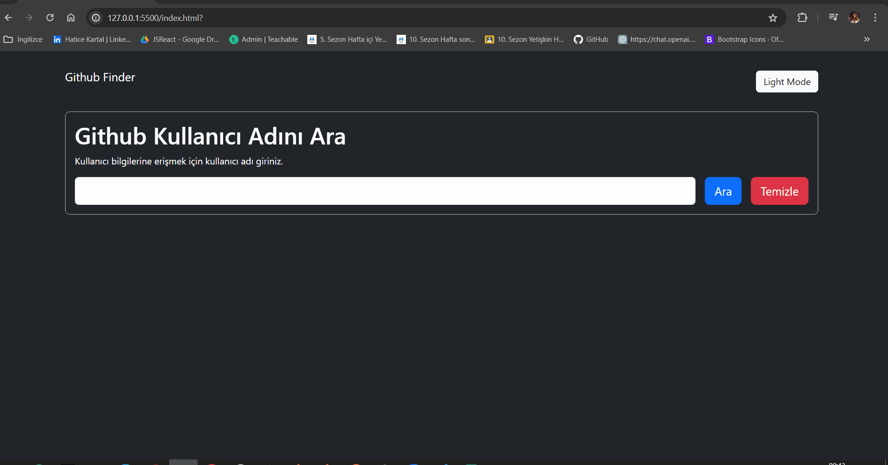

# Github-Finder
Bu depo, GitHub kullanıcılarını ve projelerini bulmayı kolaylaştıran bir proje içermektedir. Proje, GitHub API'sini kullanarak kullanıcıların profillerini ve projelerini aramasına olanak tanır. Aynı zamanda, kullanıcıların popüler kullanıcıları ve projeleri keşfetmelerine yardımcı olur.

# Özellikler 
- *Kullanıcı Arama:** Kullanıcıların GitHub üzerinde kullanıcı profillerini aramasına olanak tanır.
- *Kullanıcı Profili:** Kullanıcıların GitHub profillerini görüntüler, kullanıcı bilgilerini ve reposunu listeler.

# Kullanılar Teknolojiler
-HTML
-CSS
-JavaScript

# GIF

